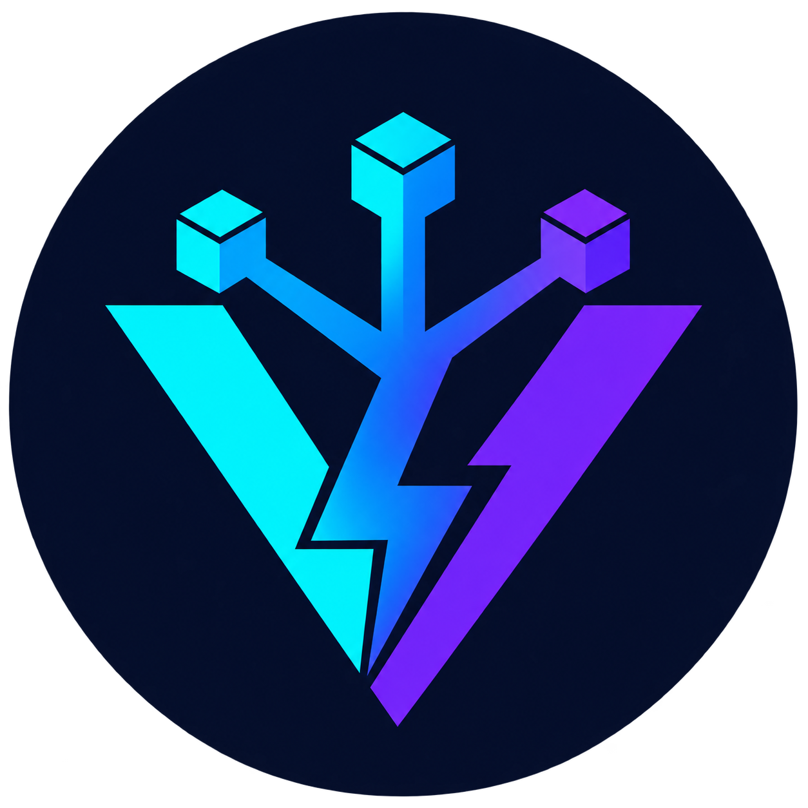
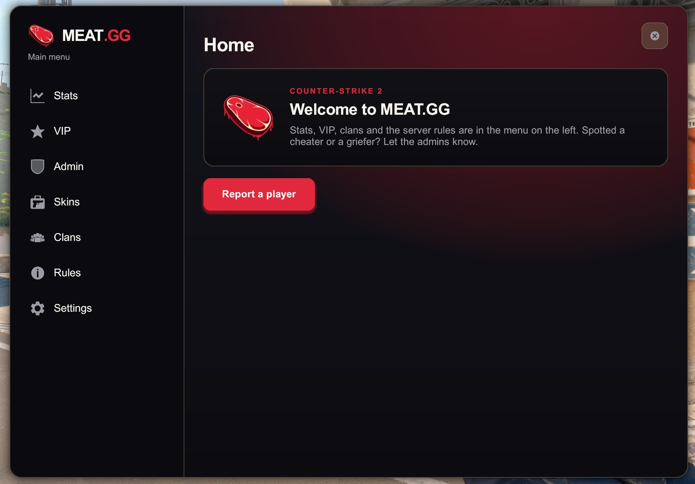

# VoltMod

[](https://github.com/voltygg/voltmod/actions/workflows/ci.yml)
[](https://voltygg.github.io/voltmod/)
[](https://github.com/voltygg/voltmod/releases/latest)
[](https://en.cppreference.com/w/cpp/23)
[](LICENSE)

<p align="center">
  
</p>

VoltMod is a framework for Counter-Strike 2 server plugins. It loads itself, so Metamod:Source is
optional. It supports C++23 today and can add more language bindings later. Built-in APIs cover commands, player tools, menus,
configuration, HTTP, and databases.

> Public APIs may change between versions.

<p align="center">
  
</p>

## Start a plugin

You need Git, [uv](https://docs.astral.sh/uv/), Python 3.14 or newer, a C++23 compiler, and a CS2
dedicated server. The generated project includes a working `!ping` command.

```sh
uvx --from git+https://github.com/voltygg/voltmod.git voltmod new project --plugin my-plugin
uv sync
uv run poe doctor
uv run poe bootstrap
uv run poe run my-plugin
```

Run `volt list` in the server console, then join the server and enter `!ping` in chat. See
[Getting started](docs/getting-started.md) for prerequisites, build presets, and troubleshooting.

## The smallest plugin

A plugin needs a manifest, an entry point, and one CMake declaration.

`plugins/my-plugin/plugin.json`:

```json
{
  "name": "my-plugin",
  "version": "1.0.0"
}
```

`plugins/my-plugin/src/App.hpp`:

```cpp
#pragma once

#include <VoltMod/Api.hpp>

namespace MyPlugin
{

struct App final : VoltMod::Plugin
{
    using Plugin::Plugin;

    bool Load() override
    {
        // "cmd.pong" is a translation key. An untranslated key is replied verbatim.
        Runtime.Commands.Add("ping").Describe("Check that the plugin is alive.").Run(
            [](VoltMod::Caller c) { return c.Ok("cmd.pong"); });
        return true;
    }
};

}  // namespace MyPlugin
```

`voltmod_add_plugin` generates the entry point for `MyPlugin::App`, the namespace spelled from the
plugin name.

`plugins/my-plugin/CMakeLists.txt`:

```cmake
voltmod_add_plugin(my-plugin)
```

`voltmod new project` writes these files and also creates settings and translation files. Add another
plugin later with `uv run poe new-plugin <name>`.

## Features

- Plugin manifests, dependencies, load status, logging, live reloads, and typed cross-plugin
  interfaces.
- Chat and console commands with typed arguments, generated usage, permissions, immunity, and
  player selectors.
- Player connection events, stable player references, per-slot state, actions, effects, timers,
  and rate limits.
- Center-HTML and Panorama menus with flows, prompts, pagination, and a center-HTML fallback.
- Custom Panorama screens, compiled resources, button input, and Workshop addon downloads.
- Chat messages, translations, sticky panels, chat input, and the game's yes/no vote panel.
- Typed access to entities, pawns, schema fields, convars, maps, game events, traces, items, sounds,
  rendering, visibility, and engine hooks.
- Gamedata and schema checks that report unavailable engine features after a game update.
- JSONC settings, asynchronous HTTP, and optional PostgreSQL, MariaDB, or SQLite access with
  migrations.
- Project scaffolding, Conan and CMake integration, local server installation, tests, formatting,
  Panorama tools, schema generation, and gamedata repair.

## Documentation

Documentation is published at [voltygg.github.io/voltmod](https://voltygg.github.io/voltmod/).

- [Getting started](docs/getting-started.md): create, build, install, and load a plugin
- [Writing a plugin](docs/plugin.md): entry points, manifests, dependencies, and lifecycle
- [Running the host](docs/host.md): console commands, loading rules, and troubleshooting
- [Configuration](docs/config.md): typed settings, validation, reloads, and translations
- [Commands](docs/commands.md): chat and console commands, arguments, and targeting
- [Menus and Panorama](docs/menu.md): multi-step menus and custom user interfaces
- [Architecture](docs/architecture.md): modules, boundaries, ownership, and lifetime
- [Framework comparison](docs/framework-comparison.md): compare VoltMod with other CS2 plugin frameworks
- [Consuming VoltMod with Conan](docs/consuming-via-conan.md): package profiles, targets, and CMake helpers
- [Changelog](CHANGELOG.md): release history and upgrade notes

## Contributing

Open an issue before starting a large change. Run these checks before submitting a change:

```sh
uv run poe lint
uv run poe test
```

## License

VoltMod is released under the [MIT License](LICENSE).
